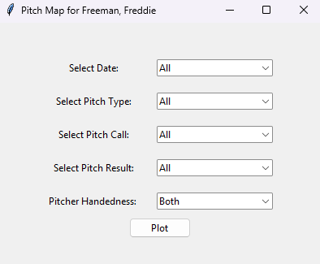
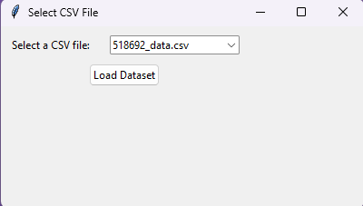
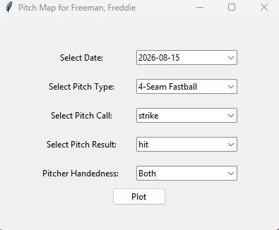
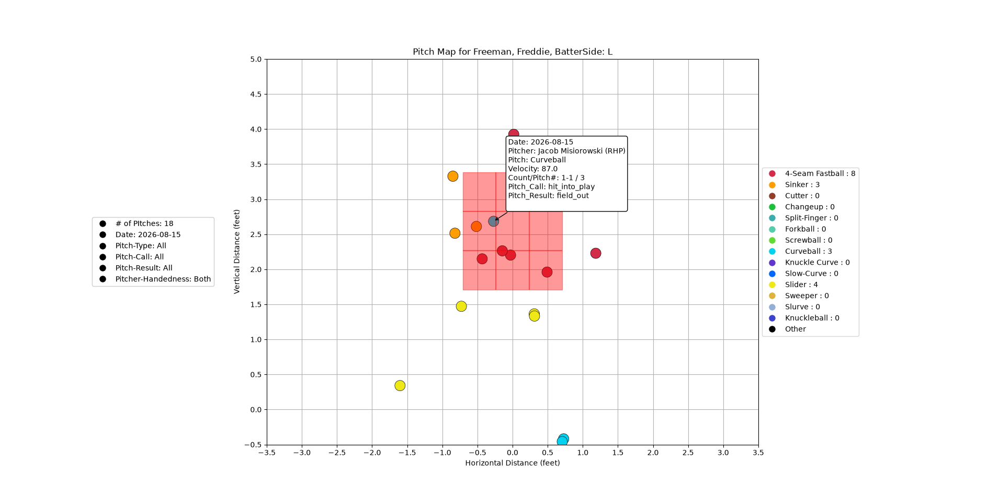
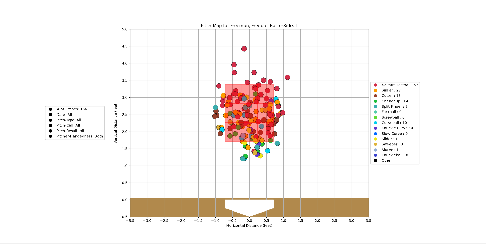

MLB Pitch Visualization

A Python-based baseball pitch visualization tool that allows users to explore and analyze pitcher data using pitch location and pitch information from CSV datasets.

Features
Select a pitcher dataset from a CSV file through a popup menu
Filter pitches by:
Date
Pitch type
Pitch call
Pitch result
Pitcher handedness
Display pitches on a strike zone visualization
Use different colors for different pitch types
Display the total number of pitches being plotted
Click on individual pitches to view detailed information
Press Escape to remove pitch information annotations
Display the selected filters and pitcher information on the graph
Automatically adjust the strike zone using the pitcher's strike zone measurements
Pitch Information

When clicking on a pitch, the visualization displays information such as:

Date
Pitcher name and handedness
Count and pitch number
Pitch type
Pitch Call
Pitch Result
Pitch velocity

Technologies Used
Python
Pandas
NumPy
Matplotlib
Tkinter
CSV datasets
Data

The project uses baseball pitch tracking data stored in CSV files. Baseball Savant and Razzball CSV files were used to gather all the data.

Purpose

This project was created to practice working with baseball data, data filtering, visualization, and interactive Python applications. It is designed to make pitch data easier to explore and understand through an interactive pitch map.

Work Examples

